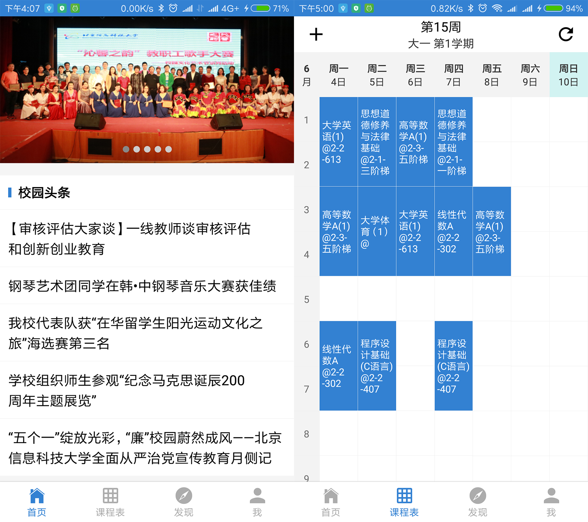
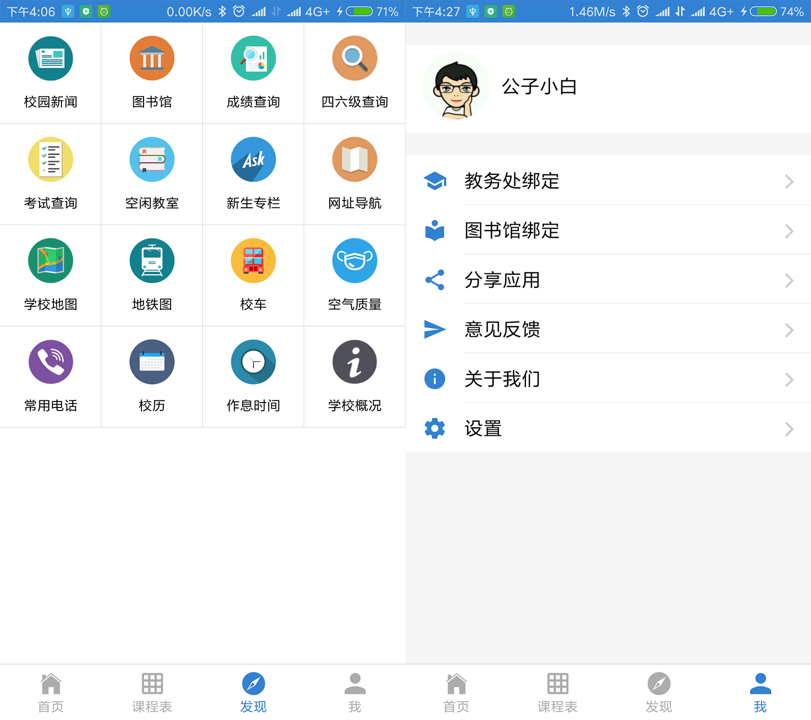
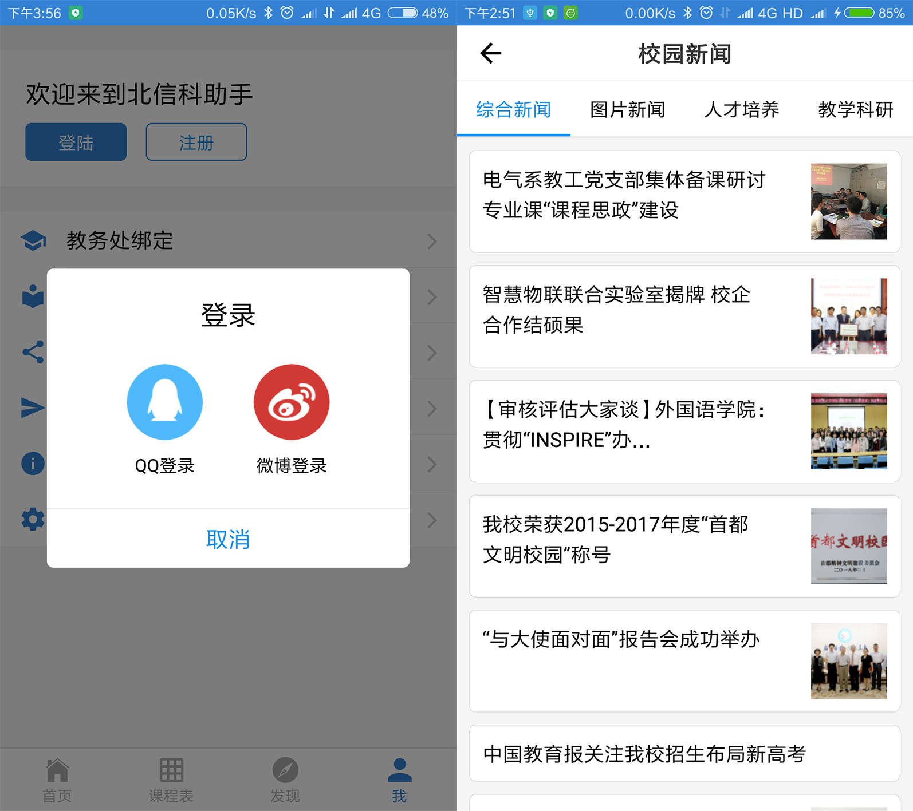
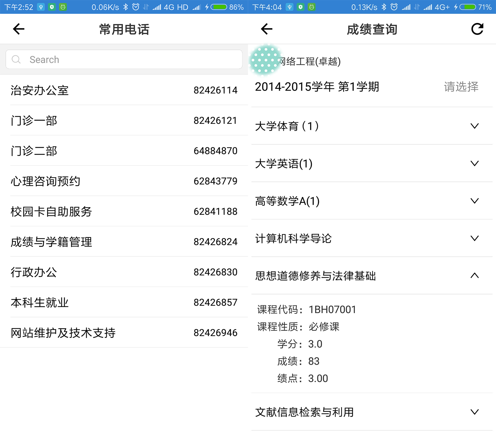
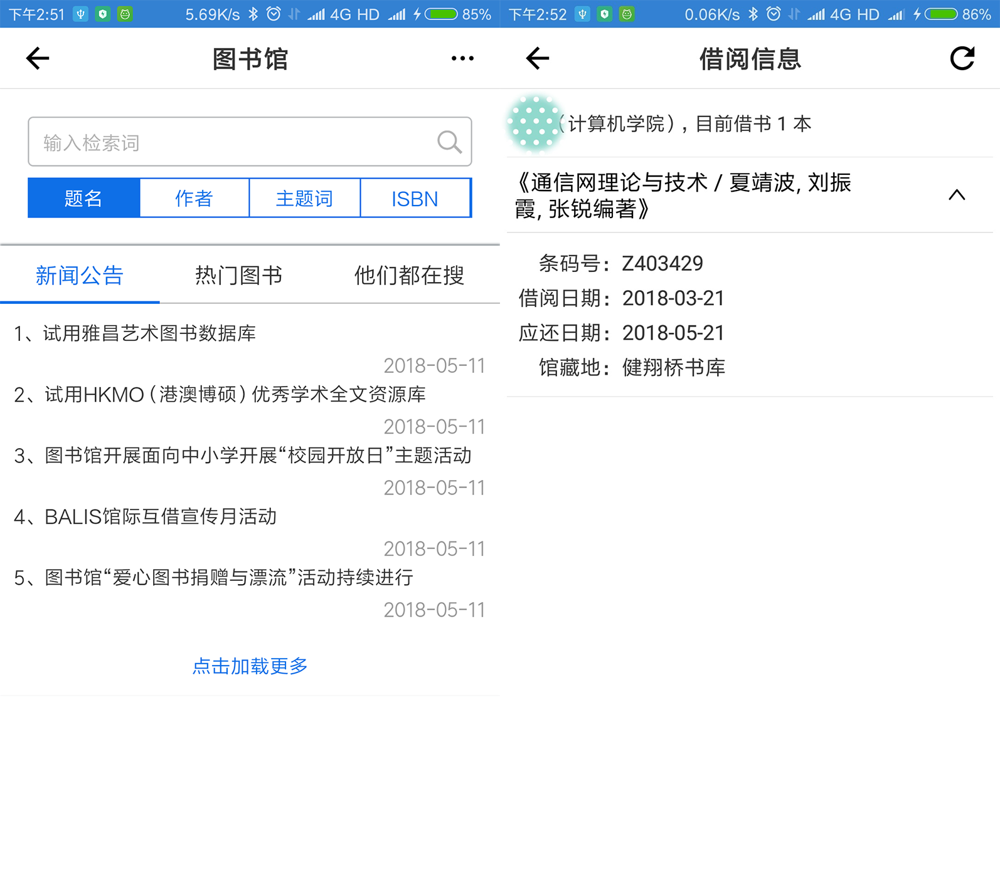
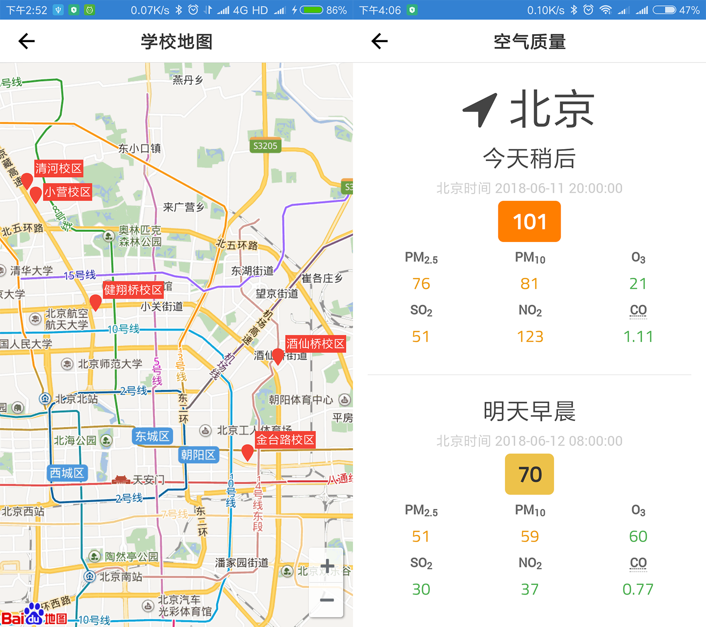
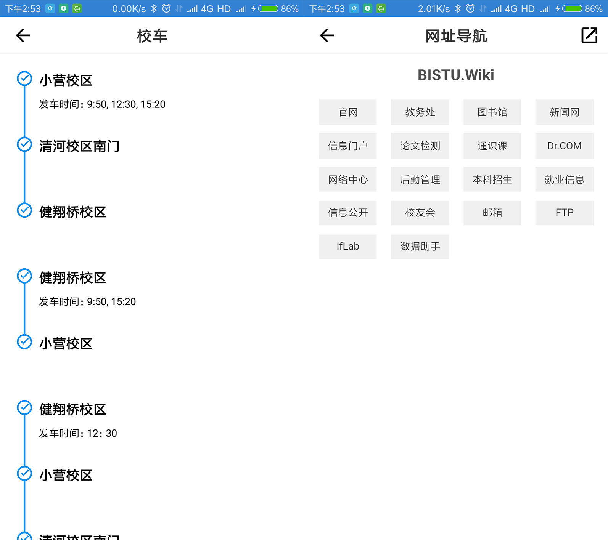

# BistuHelper
一款北京信息科技大学校园助手App，目前实现的功能包括课程表、校园新闻、成绩查询、考试查询、四六级查询、图书馆检索、借阅查询、常用电话、校历、学校地图、地铁图、校车、空气质量、网址导航等

## 相关项目：
[bistuhelper-api](https://github.com/uniquexiaobai/bistuhelper-api)      
[bistuhelper-view](https://github.com/uniquexiaobai/bistuhelper-view)

## 一些截图：

